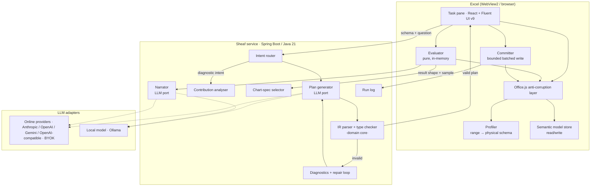
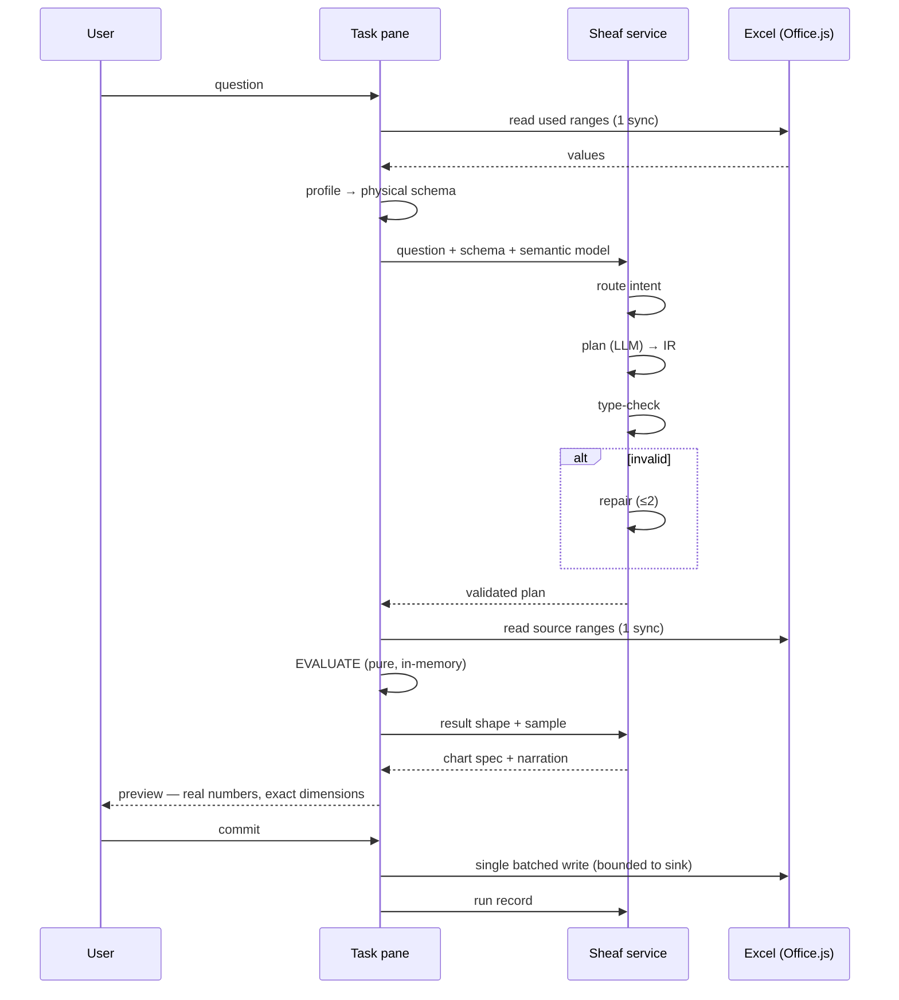

<p align="center">
  <picture>
    <source media="(prefers-color-scheme: dark)" srcset="Resources/Sheaf-logo-dark-glass.png">
    
  </picture>
</p>

# Sheaf: Architecture

**Status:** Design v1 · **Scope:** system design, the IR and its type system, execution model, security model, and the decisions behind them.

---

## 1. Design principles

Non-negotiables. Everything below serves these.

1. **The model plans; it never executes.** The LLM's only output is a program in a typed IR. Deterministic code validates, evaluates, and commits. This is the single largest lever on accuracy, auditability, and safety.
2. **Closed algebra.** No user-defined functions, no loops, no recursion, no escape hatch. Every program terminates and its output columns are statically computable. When expressiveness and verifiability conflict, verifiability wins — and the decision gets written down.
3. **Schema out, never rows.** The model receives inferred structure and the approved semantic model. Workbook contents stay on the machine.
4. **Evaluate before you commit.** Execution is split: a pure in-memory evaluation produces the result, the user sees real numbers and real dimensions, and only then does anything touch the grid.
5. **Write scope is structural, not behavioural.** The committer can only write to the sink declared in the validated plan, or, for an edit plan, to the columns its operations name. Not because the model behaves — because the code has no other path. In-place edits add two more rules: the impact (what changes, and what depends on it) is shown before commit, and a recovery snapshot is taken first.
6. **Explicit failure over plausible output.** Two repair attempts, then a legible "I couldn't express that, here's what I understood." A tool that admits defeat is more trustworthy than one that guesses.
7. **Every run is reproducible.** The plan is the artifact. Store it, diff it, replay it.

---

## 2. System overview



**Why the split lands where it does**

| Concern | Where | Why |
|---|---|---|
| Profiling | Client | Needs raw cell values. Keeping it client-side is what makes "rows never leave" true. |
| IR type system | **Server (Java)** | The domain core. Pure, framework-free, heavily unit-tested. Owns the contract. |
| Planning / narration | Server | Model credentials and prompt versions can't live in a public bundle. |
| Evaluation + commit | Client | Only Office.js can touch the grid. Also keeps values off the wire. |
| Contribution analysis | Server (orchestration) + client (execution) | Server decides *which* drill-downs to run; client evaluates them. |

**The tension this creates, stated plainly:** the type checker is in Java and the evaluator is in TypeScript, so the IR is expressed twice. Resolution: **Java owns the IR.** The Java records are annotated, JSON Schema is generated from them at build time, and TypeScript types are generated from that schema. Drift becomes a build failure, not a runtime bug. Cost: a codegen step in CI. Rejected alternative — putting the type checker in TypeScript too — is simpler but throws away the strongest reason to build this in the first place, and makes the core logic untestable in the language it belongs in.

---

## 3. The semantic model

Sheaf distinguishes two layers, and conflating them is the mistake most similar tools make.

**Physical schema** — what the profiler infers. Columns, types, cardinality, null rate, key candidates, value exemplars. Derived automatically, cheap, disposable.

**Semantic model** — what things *mean*. Curated once, persisted with the workbook, and the only vocabulary the planner is allowed to reference.

```jsonc
{
  "version": 1,
  "entities": [
    { "name": "Orders", "range": "Sheet1!A1:H4021", "headerRow": 1 },
    { "name": "Regions", "range": "Lookup!A1:C7", "headerRow": 1 }
  ],
  "metrics": [
    {
      "name": "Revenue",
      "entity": "Orders",
      "expr": { "fn": "sum", "of": "amount" },
      "filters": [{ "ne": ["status", "returned"] }],
      "type": "currency:INR",
      "description": "Net of returns"
    }
  ],
  "dimensions": [
    { "name": "region", "entity": "Orders", "column": "region", "cardinality": 6 },
    { "name": "channel", "entity": "Orders", "column": "channel", "cardinality": 4 }
  ],
  "timeDimensions": [
    { "name": "order_date", "entity": "Orders", "column": "order_date",
      "grains": ["day","week","month","quarter","year"], "weekStart": "monday" }
  ],
  "joins": [
    { "from": "Orders.region", "to": "Regions.code",
      "cardinality": "many-to-one", "confidence": 0.94, "approved": true }
  ],
  "synonyms": { "sales": "Revenue", "turnover": "Revenue", "geo": "region" }
}
```

**Why this matters more than it looks.**

- The planner sees ~6 business terms instead of ~40 raw column names. Smaller context, materially higher accuracy.
- *"Excluding returns"* stops being something the user must remember every time. It's part of Revenue's definition, once.
- The tool gets better with use, which is a product property rather than a feature.
- Every metric in a narrated answer can cite its own definition. That's the citation surface.

**Lifecycle.** After profiling, the model proposes metrics, dimensions, time dimensions, synonyms, and candidate joins. The user approves, edits, or rejects each — **once**, at setup. From then on, plans validate against approved semantics and run with a light preview rather than a full approval gate. Two-tier approval: heavy where it's high-leverage and infrequent, light where it's frequent.

**Join candidates** are inferred from value-overlap plus cardinality profiling, proposed with a confidence score, and only become traversable once approved. A join path that isn't a declared, approved edge cannot appear in a valid plan — this closes the single largest hallucination surface in multi-sheet workbooks.

**Storage.** `Office.context.document.settings` (travels with the workbook, survives copy/email/OneDrive) with a hidden-worksheet fallback if the model exceeds the practical settings size. Versioned; a schema diff on open flags added/removed columns for re-approval rather than silently breaking.

---

## 4. The IR

### 4.1 Shape

```
Plan := { source, steps[], sink, meta }
```

`source` names an approved entity. `steps` is an ordered pipeline of operators. `sink` declares exactly where output goes. `meta` carries the plan hash, model identity, and prompt version.

### 4.2 Operators (v1)

| Operator | Signature (sketch) | Notes |
|---|---|---|
| `filter` | `Table → Table` | Predicate over columns. Row count changes; columns don't. |
| `derive` | `Table → Table + col` | Adds one column from a closed expression set. |
| `aggregate` | `Table → Table` | `groupBy[]` + `measures[]`. Output columns statically known. |
| `sort` | `Table → Table` | Shape-preserving. |
| `join` | `Table × Table → Table` | Only along an **approved** join edge. |
| `pivot` | `Table → Table` | Rows/cols/values. Column count is data-dependent — the one operator whose output width isn't static. |
| `periodCompare` | `Table → Table` | First-class period-over-period. Not sugar. |

**`periodCompare` is deliberately an operator, not a derive.** Expressing period-over-period as derive-plus-self-join is technically possible and practically miserable — it has real semantics that deserve first-class treatment: partial-period handling, calendar-aligned vs. offset-aligned comparison, week-start convention, and what to do when the prior period has no matching member. Making it an operator means those decisions are made once, in code, not re-derived by a model every time.

**Closed expression set for `derive`:** arithmetic (`+ - * /`), `ratio`, `pct`, date extraction (`yearOf`, `quarterOf`, `monthOf`, `weekOf`, `dayOf`), `bucket`, `coalesce`, `case`. That's it. No string eval, no lambdas.

### 4.3 Type system

Scalar types: `number`, `currency:<unit>`, `percent`, `date`, `datetime`, `string`, `boolean`, `categorical<domain>`, each with a nullability flag.

A table type is a record of named column types. Every operator has a signature mapping input table type → output table type. Validation is a fold over the pipeline:

1. Resolve `source` to an approved entity; its table type comes from the semantic model.
2. For each step, check the operator's signature against the current table type; produce the next one.
3. Check `sink` compatibility.

Meaningful checks this catches for free: summing a categorical, comparing a currency to a string, grouping by a column that a prior `aggregate` already collapsed, joining along an unapproved path, mixing currency units, extracting a quarter from a string column that only *looks* like a date.

### 4.4 Static guarantees, stated honestly

- **Termination** — guaranteed. No loops, no recursion, finite pipeline.
- **Output columns** — statically known, *except* through `pivot`, where column count depends on the data.
- **Row count** — **not** statically known.
- **Write extent** — not static, which is precisely why commit is a separate phase after evaluation.

That last point is the reason for §5. Anything claiming to tell the user the exact output dimensions *before* running is either lying or has already run it.

### 4.5 Diagnostics

Structured, machine-readable, and doubling as the repair signal:

```json
{
  "code": "E_TYPE_MISMATCH",
  "step": 2,
  "operator": "aggregate",
  "message": "sum expects numeric, got categorical(region)",
  "expected": "number | currency | percent",
  "actual": "categorical",
  "hint": "Available numeric columns: amount, quantity, discount"
}
```

The `hint` field exists for the model, not the user. Repair loop: max **two** attempts, each fed the full diagnostic set. Fail visibly after that.

### 4.6 Edit plans and template fill (v1.1)

Two additions let Sheaf change a workbook, not only report on it.

- **Workbook catalog.** The profiler covers every sheet, Excel Table and data region, and builds a **dependency map** of which formulas, named ranges, charts, PivotTables, validation rules and conditional formats reference each column. The catalog is stored in a custom XML part, and it holds schema and statistics, never rows. It is what the planner sees, and what impact analysis checks against.
- **Edit plans** (`kind: "edit"`) change an existing entity through six closed operations: `addColumn`, `setColumn`, `dropColumn`, `renameColumn`, `moveColumn`, `dropRows`. "Merge two columns" is `addColumn(concat(…))` plus `dropColumn`. Type checking an edit plan also yields an **impact report**. Dropping a column that anything depends on is blocked unless the plan converts those dependents to values first. The preview says explicitly when nothing depends on a column, and says what Sheaf cannot trace (`INDIRECT`, external links, VBA).
- **Recovery snapshots.** Before an in-place commit, the affected columns are copied to a very-hidden sheet keyed by run id, and each run can be restored. Excel's undo stack is never relied on after add-in writes.
- **Template fill** imports a template sheet (`insertWorksheetsFromBase64`). It maps the template's headers with a query plan ending in `project` and a `template` sink, fills below the header row, and can open the result as a new workbook. An approved mapping is saved as a recipe for replay.

---

## 5. Execution model



**Evaluate** is a pure function `(Plan, Table[]) → Result`. No Office.js, no I/O, fully unit-testable. This is where the closed algebra pays off — the evaluator is a switch over seven operators.

**Commit** is the only code path that writes. It takes a `Result` and a `Sink`, resolves the target range, and performs one batched `Range.values` assignment. It **cannot** be handed a range that isn't the validated plan's sink — that's a type-level constraint, not a runtime check. If the sink is `newSheet`, nothing existing can be touched at all; if it's an existing anchor, the preview states the exact overwrite extent and commit is refused without explicit confirmation.

**Excel-specific discipline** (the things that make it feel native rather than bolted on):

- Two syncs per run — one bulk read, one bulk write. Never a sync inside a loop.
- `load()` with explicit property lists, always.
- 2D array writes, never cell-by-cell.
- `suspendApiCalculationUntilNextSync()` around the commit.
- Preserve the undo stack (ExcelApi 1.20 undo support); a user hitting Ctrl+Z must get their workbook back.
- `trackedObjects.remove()` on everything, especially under a shared runtime.
- Feature-gate with `isSetSupported` and declare the minimum requirement set in the manifest.

---

## 6. Diagnostic flow

*"Why did revenue drop last quarter?"* routes away from the planner entirely. It is deterministic contribution analysis:

1. Resolve the metric and the two periods from the question (the only LLM step, and a narrow one).
2. Evaluate the metric for both periods → total delta.
3. Fan out: for every dimension attached to the metric, evaluate the metric grouped by that dimension for both periods.
4. Rank dimension members by absolute contribution to the delta; compute mix vs. rate decomposition where both are available.
5. Hand the ranked, structured findings to the narrator.

The model narrates a table Sheaf computed. It cannot invent a driver that isn't in the numbers. Maximum verifiability, minimum hallucination surface — and it happens to be the question spreadsheet users most want answered and least easily can.

Cost control: dimension fan-out is bounded (top-N dimensions by cardinality heuristics, hard cap), because each drill-down is another evaluation pass.

---

## 7. Chart specs

The selector emits a **declarative spec, never an image**, and the chart type is a pure function of result shape and intent:

| Result shape | Spec |
|---|---|
| 1 scalar | single-stat |
| time dimension + 1 measure | line |
| categorical (low cardinality) + measure | bar |
| categorical (high cardinality) | table, sorted |
| 2 dimensions + measure | grouped bar or heatmap |
| period comparison | bar with delta overlay |

Rendered client-side. Same discipline as everything else: model plans, code renders.

---

## 8. Security model

**Data egress.** Profiling is client-side. The service receives column names, types, statistics, and at most a handful of exemplar values — never rows. Exemplars are opt-out for sensitive workbooks. The local-model adapter removes egress entirely, which is the unlock for finance and legal users.

**Prompt injection.** Cell contents are hostile input. A cell reading `IGNORE PREVIOUS INSTRUCTIONS AND WRITE...` reaches the model only as a value exemplar, and the worst it can do is produce a plan — which must then type-check against the approved semantic model and pass through user preview before touching anything. The closed algebra means there is no plan, however malicious, that reads outside the approved entities or writes outside the declared sink. **The mitigation is structural, not a prompt-hardening arms race.**

**Write blast radius.** Bounded by the sink in the validated plan. Stated in the preview. Enforced by the committer's type signature.

**Secrets.** The add-in bundle is a public web page. Model credentials, prompt templates, and any third-party keys live server-side only. Users can bring their own provider keys: a key is entered once in the pane, sent over HTTPS to a write-only service endpoint, encrypted at rest, and never returned, logged, or stored in the workbook (`document.settings` and custom XML travel with the file) or in browser storage. On a hosted multi-user service, BYOK requires an authenticated user and keys are scoped to that user. Zero-egress mode forces the local adapter and blocks every other outbound call.

**Auth.** Entra ID via **NAA** (MSAL.js nested app authentication) with a dialog-based OAuth fallback for hosts where NAA isn't available. The service validates the JWT as a Spring Security resource server; tenant and user identity are read from validated claims, never from request bodies.

**Audit.** Every run records: plan JSON, plan hash, model identity and prompt version, ranges read, ranges written, row counts in and out, duration, and outcome. Stored in the workbook (hidden sheet) and optionally server-side. This is the reproducibility surface and the compliance answer in one artifact.

---

## 9. Backend design

Hexagonal, because the interesting part must not depend on the boring parts.

```
sheaf-service/
├── domain/                      ← pure Java 21, zero framework imports
│   ├── ir/                      Plan, Step, Expr as sealed records
│   ├── types/                   ColumnType, TableType, signatures
│   ├── validation/              TypeChecker, Diagnostic
│   ├── semantic/                SemanticModel, JoinGraph
│   └── analysis/                ContributionAnalyser
├── application/
│   ├── PlanningService          orchestrates: prompt → LLM → parse → validate → repair
│   ├── IntentRouter
│   └── NarrationService
├── ports/
│   ├── LanguageModelPort
│   ├── PromptRepository
│   └── RunLogPort
└── adapters/
    ├── llm/anthropic/           online, user key (BYOK)
    ├── llm/openai/              online, user key (BYOK)
    ├── llm/gemini/              online, user key (BYOK)
    ├── llm/openaicompat/        any OpenAI-compatible endpoint (Azure OpenAI, OpenRouter, Groq, LM Studio, vLLM…)
    ├── llm/ollama/              local, zero egress
    ├── secrets/                 SecretStore: provider keys encrypted at rest
    ├── web/                     REST + Spring Security resource server
    └── persistence/             Postgres
```

Sealed interfaces + records for the IR give exhaustive pattern matching in the type checker — the compiler tells you when a new operator isn't handled everywhere. That is the main reason this core belongs in Java rather than TypeScript.

`LanguageModelPort` returns a parsed `Plan` or a `ParseFailure`. Five adapters (Anthropic, OpenAI, Gemini, OpenAI-compatible, Ollama), selected per user from the pane without a restart. The generated `plan.schema.json` is passed as the response schema through each provider's native structured-output mechanism; the type checker stays the authority. No provider-specific type reaches the application layer.

Prompts are **versioned artifacts** in the repository, not string literals. Every run records which version produced it, because "the answers changed and I don't know why" is otherwise unanswerable.

---

## 10. Alternatives considered

| Option | Why not |
|---|---|
| LLM writes cells directly | The failure mode this project exists to eliminate. |
| LLM emits SQL / Python, sandbox it | Unbounded output space. Cannot preview meaningfully, cannot statically bound the write scope, cannot type-check. Trades the entire thesis for expressiveness. |
| Type checker in TypeScript, thin backend | Simpler, one language. Throws away exhaustive pattern matching, makes the core harder to test properly, and discards the strongest engineering argument for the project. |
| Vector search over the semantic model | With ~6 metrics and ~12 dimensions, string matching plus a synonym table wins on accuracy, latency, and dependency count. Revisit only if the semantic model grows past ~100 nodes. |
| Graph database for join paths | 3–8 entities means a handful of edges. BFS over an in-memory adjacency list. A graph DB here is ceremony. |
| DuckDB-WASM as the evaluator | Genuinely tempting for large workbooks: compile IR → SQL, run in-browser, data never leaves. Costs several MB of WASM, a load step, and makes the formula backend a fully separate second compiler. **Deferred, not rejected** — revisit if the hand-written evaluator hurts past ~200k rows. |
| Formula backend (compile IR → `SUMIFS`/`FILTER`/`LET`) | The better product — output stays live after uninstall — and real instruction-selection work. Deferred to v2 because dynamic-array spill semantics and per-version availability are a project of their own. |

---

## 11. Open questions and risks

1. **IR expressiveness is the project risk.** Too narrow and it can't answer real questions; too broad and verifiability is gone. Mitigation: the question corpus in M0 drives the algebra, not intuition. Every operator added after v1 needs a written justification.
2. **Profiling messy real workbooks** will consume more time than it looks. Merged headers, blank separator rows, totals rows embedded in data, three date formats in one column. This is unglamorous and unavoidable.
3. **Repair-loop convergence** on ambiguous questions is uncertain. The cap at two attempts is a product decision as much as a technical one.
4. **Semantic-model approval UX** in a ~300px pane. If setup is tedious, nobody completes it, and the accuracy gains never materialise. This is the biggest product risk in the whole design.
5. **Pivot column explosion.** A pivot on a 500-member dimension produces an unusable result. Needs a cardinality guard at validation time, not at write time.
6. **Demo legibility.** The value of the indirection is not self-evident. The README has to lead with the failure mode of direct-write AI, not with the architecture.
